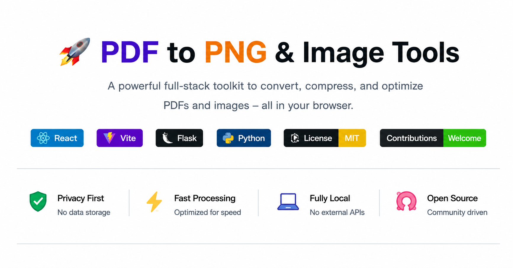

## PDF to PNG & Image Tools

<p align="center">
  
</p>

---

This project is a comprehensive full‑stack web app for doing simple, local file manipulations:

**PDF Tools:**

- Convert PDF pages to PNG (single page, range, or all pages)
- Merge multiple PDF files into one document
- Split a PDF by extracting a page range into a new document
- Convert PDF to DOCX
- Convert DOCX to PDF
- Rotate or flip PDF pages
- Add watermarks to PDFs
- Sign PDFs

**Image Tools:**

- Convert images to WebP, JPG, PNG, and SVG
- Compress images with adjustable quality
- Resize images
- Rotate or flip images
- Remove the background from images
- Upscale images
- Convert to grayscale
- Convert image DPI for print-ready output
- Add watermarks to images
- View, copy and strip image EXIF metadata
- Extract text from images (OCR)
- Convert images to Base64

**MD tools**

- Convert Markdown files to HTML with optional theme styling

The backend is a Flask API and the frontend is a React app (Vite).

### Project Rules

These rules define how this project must be implemented and extended:

1. **No data can be stored in the backend.**  
   The server must only process files in memory for the current request and immediately return the result. No files or metadata may be written to disk, databases, or any external storage.

2. **No external API usage.**  
   All functionality must be implemented locally using libraries in this repository. Do not call third‑party web APIs or hosted services.

3. **Only file‑manipulation features.**  
   New features are welcome as long as they are related to local file manipulation (e.g., format conversion, compression, resizing, merging, splitting, optimizing) and obey Rules 1 and 2.

If you contribute to this repository, you must respect all the rules above.

---

## Tech Stack

- **Backend:** `Python`, `Flask`, `Flask‑CORS`, `PyMuPDF (fitz)`, `Pillow`, `rembg`, `python-docx`, `pdf2docx`, `OpenCV`, `pytesseract`,`markdown2`
- **Frontend:** React, React Router, Vite, PDF.js

---

## Project Structure

```
AllInOneConverter/
├── backend/
│   ├── main.py
│   ├── requirements.txt
│   ├── Dockerfile
│   ├── app/
│   │   └── __init__.py
│   ├── blueprints/
│   │   ├── __init__.py
│   │   ├── pdf.py
│   │   ├── image.py
│   │   ├── removebg.py
│   │   ├── rotate_flip.py
│   │   ├── metadata_viewer.py
│   │   ├── dpi_converter.py
│   │   ├── merge_pdf.py
│   │   ├── split_pdf.py
│   │   ├── pdf_to_docx.py
│   │   ├── docx_to_pdf.py
│   │   ├── watermark.py
│   │   ├── md2html.py
│   │   └── markdown.py
|   |
│   └── utils/
│       ├── __init__.py
│       ├── helpers.py
│       └── decorators.py
├── frontend/
│   ├── package.json
│   ├── vite.config.js
│   ├── eslint.config.js
│   ├── index.html
│   ├── Dockerfile
│   ├── README.md
│   ├── vercel.json
│   ├── public/
│   └── src/
│       ├── main.jsx
│       ├── App.jsx
│       ├── App.css
│       ├── index.css
│       ├── ErrorBoundary.jsx
│       ├── components/
│       │   ├── FileUploadArea.jsx
│       │   ├── ScrollToTop.jsx
│       │   ├── ToolPageTemplate.jsx
│       │   ├── Layout/
│       │   │   └── Layout.jsx
│       │   ├── Sidebar/
│       │   │   └── Sidebar.jsx
│       │   └── Landing/
│       │       ├── FeatureCard.jsx
│       │       ├── FeatureSection.jsx
│       │       ├── Footer.jsx
│       │       ├── HeroSection.jsx
│       │       ├── Navbar.jsx
│       │       ├── ToolCard.jsx
│       │       ├── ToolCard.css
│       │       ├── ToolsGrid.jsx
│       │       └── TrustBanner.jsx
│       ├── data/
│       │   └── toolsData.jsx
│       ├── hooks/
│       │   └── useFileUpload.js
│       ├── pages/
│       │   ├── LandingPage.jsx
│       │   ├── NotFound.jsx
│       │   ├── PdfPng.jsx
│       │   ├── PdfMerge.jsx
│       │   ├── PdfSplit.jsx
│       │   ├── PdfDocx.jsx
│       │   ├── DocxPdf.jsx
│       │   ├── PdfRotateFlip.jsx
│       │   ├── PDFWatermark.jsx
│       │   ├── PdfSign.jsx
│       │   ├── MdToHtml.jsx
│       │   ├── ImageWbp.jsx
│       │   ├── ImageJpg.jsx
│       │   ├── ImagePdf.jsx
│       │   ├── ImageCompress.jsx
│       │   ├── ImageDpi.jsx
│       │   ├── ImageResize.jsx
│       │   ├── ImageGrayScale.jsx
│       │   ├── ImageMetadata.jsx
│       │   ├── ImageOCR.jsx
│       │   ├── ImageToSVG.jsx
│       │   ├── ImageUpscale.jsx
│       │   ├── ImageWatermark.jsx
│       │   ├── ImageBase64.jsx
│       │   ├── RemoveBg.jsx
│       │   ├── RotateFlip.jsx
│       │   └── ImageWatermark.css
│       └── styles/
│           └── ImageWatermark.css
├── docker-compose.yml
├── CONTRIBUTING.md
├── LICENSE
└── README.md
```

### Folder Descriptions

**Backend** (`backend/`)

- `main.py` – Entry point for the Flask server; initializes the app and registers blueprints
- `requirements.txt` – Python dependencies for the backend
- `Dockerfile` – Docker configuration for containerizing the backend
- `app/` – Flask app configuration and initialization
- `blueprints/` – Modular route handlers for each feature:
  - `pdf.py` – PDF to PNG conversion endpoint
  - `image.py` – Image format conversions and compression (WebP, JPG, PNG, SVG, Base64)
  - `dpi_converter.py` – Image DPI converter endpoint
  - `metadata_viewer.py` – View and strip metadata endpoint
  - `removebg.py` – Background removal endpoint
  - `rotate_flip.py` – Rotate/flip endpoint for images
  - `merge_pdf.py` – Merge multiple PDFs into one endpoint
  - `split_pdf.py` – Split PDF by page range endpoint
  - `pdf_to_docx.py` – Convert PDF to DOCX endpoint
  - `docx_to_pdf.py` – Convert DOCX to PDF endpoint
  - `watermark.py` – Add watermarks to PDFs and images endpoint
  - `md2html.py` - Converts MD to HTML with built-in css
- `utils/` – Helper functions and utilities used across blueprints:
  - `helpers.py` – Common utility functions
  - `decorators.py` – Custom decorators for request handling

**Frontend** (`frontend/`)

- `package.json` – Node.js dependencies and scripts
- `vite.config.js` – Vite bundler configuration
- `eslint.config.js` – ESLint linting rules
- `index.html` – HTML entry point
- `Dockerfile` – Docker configuration for containerizing the frontend
- `vercel.json` – Vercel deployment configuration
- `src/` – React source code:
  - `main.jsx` – React app entry point
  - `App.jsx` – Root React component
  - `ErrorBoundary.jsx` – Error boundary component for error handling
  - `components/` – Reusable UI components:
    - `FileUploadArea.jsx` – File upload area component
    - `ScrollToTop.jsx` – Scroll to top button component
    - `ToolPageTemplate.jsx` – Template for tool pages
    - `Layout/` – Main page layout wrapper
    - `Sidebar/` – Navigation sidebar component
    - `Landing/` – Landing page components:
      - `FeatureCard.jsx` – Feature card component
      - `FeatureSection.jsx` – Feature section component
      - `Footer.jsx` – Footer component
      - `HeroSection.jsx` – Hero section component
      - `Navbar.jsx` – Navigation bar component
      - `ToolCard.jsx` – Tool card component
      - `ToolsGrid.jsx` – Tools grid component
      - `TrustBanner.jsx` – Trust banner component
  - `data/` – Data files:
    - `toolsData.jsx` – Tool configurations and metadata
  - `hooks/` – Custom React hooks:
    - `useFileUpload.js` – Hook for file upload functionality
  - `pages/` – Page components for each feature:
    - `LandingPage.jsx` – Main landing page
    - `NotFound.jsx` – 404 page
    - **PDF Tools:**
      - `PdfPng.jsx` – PDF to PNG converter page
      - `PdfMerge.jsx` – PDF merge page
      - `PdfSplit.jsx` – PDF split page
      - `PdfDocx.jsx` – PDF to DOCX converter page
      - `DocxPdf.jsx` – DOCX to PDF converter page
      - `PdfRotateFlip.jsx` – PDF rotate/flip page
      - `PDFWatermark.jsx` – PDF watermark page
      - `PdfSign.jsx` – PDF signing page
    - **Image Tools:**
      - `ImageWbp.jsx` – Image to WebP converter page
      - `ImageJpg.jsx` – Image to JPG converter page
      - `ImagePdf.jsx` – Image to PDF converter page
      - `ImageCompress.jsx` – Image compression page
      - `ImageDpi.jsx` – Image DPI converter page
      - `ImageResize.jsx` – Image resize page
      - `ImageGrayScale.jsx` – Convert image to grayscale page
      - `ImageMetadata.jsx` – View/strip metadata page
      - `ImageOCR.jsx` – Optical Character Recognition (OCR) page
      - `ImageToSVG.jsx` – Convert image to SVG page
      - `ImageUpscale.jsx` – Image upscale page
      - `ImageWatermark.jsx` – Add watermark to image page
      - `ImageBase64.jsx` – Convert image to Base64 page
      - `RemoveBg.jsx` – Background removal page
      - `RotateFlip.jsx` – Rotate/flip image page
    - **MD Tools:**
      - `MdToHtml.jsx` - converts MD to HTML
  - `styles/` – Global stylesheets:
    - `ImageWatermark.css` – Image watermark styles
- `public/` – Static assets

---

## Getting Started

### 1. Clone the repository

```bash
git clone https://github.com/username/AllInOneConverter.git
cd AllInOneConverter
```

### 2. Backend setup

From the `backend` folder:

```bash
cd backend
python -m venv venv
venv\Scripts\activate  # On Windows
pip install -r requirements.txt
python main.py
```

The Flask server will run at `http://localhost:5000`.

Available endpoints:

**PDF Endpoints:**

- `POST /convertPng` – Convert PDF pages to PNG (single page, range, or all pages)
- `POST /merge-pdf` – Merge multiple PDFs into one
- `POST /split-pdf` – Extract a page range from a PDF
- `POST /pdf-to-docx` – Convert PDF to DOCX
- `POST /docx-to-pdf` – Convert DOCX to PDF
- `POST /rotate-flip-pdf` – Rotate or flip PDF pages
- `POST /watermark-pdf` – Add watermarks to PDF

**Image Endpoints:**

- `POST /convertWebP` – Convert an image to WebP
- `POST /convertJpeg` – Convert an image to JPG
- `POST /imageToPdf` – Convert image to PDF
- `POST /compress` – Compress an image with a quality setting
- `POST /rotateFlip` – Rotate or flip an image
- `POST /convert-dpi` – Convert image DPI (JPEG, PNG, TIFF, BMP, WebP)
- `POST /check-dpi` – Check current DPI of an image
- `POST /view-metadata` – View image metadata
- `POST /strip-metadata` – Strip metadata from image
- `POST /removeBg` – Remove the background from an image
- `POST /watermark-image` – Add watermarks to an image
- `POST /image-to-base64` – Convert image to Base64

**Mark Down Endpoints**

- `POST /convertMdToHtml` – Converts MD to HTML

**Health Check:**

- `GET /health` – Health check endpoint

All endpoints:

- Process the file in memory
- Do **not** persist any data on the server

Note: The PDF to PNG tool runs in the browser using PDF.js and supports single page, range, or all pages (ZIP for multi‑page output). The backend still includes `/convertPng` for server‑side PDF conversion, but the UI uses client‑side rendering by default.

### 3. Frontend setup

From the `frontend` folder:

```bash
cd frontend
npm install
npm run dev
```

By default, Vite will start the frontend at `http://localhost:5173`.

Make sure your frontend API calls target `http://localhost:5000` for the backend.

## Running with Docker (Recommended)

The easiest way to get started is using Docker and Docker Compose. This ensures all dependencies (including system tools like `poppler-utils`) are correctly installed.

### 1. Prerequisites

- [Docker](https://www.docker.com/get-started)
- [Docker Compose](https://docs.docker.com/compose/install/)

### 2. Run the application

From the root directory, run:

```bash
docker-compose up --build
```

- **Frontend**: http://localhost:5173
- **Backend**: http://localhost:5000
- **Health Check**: http://localhost:5000/health

### 3. Development Workflow

The `docker-compose.yml` is configured for development:

- **Hot Reloading**: Changes in `backend/` or `frontend/` will automatically reload the application.
- **Persistent Models**: The `rembg` AI models are stored in a Docker volume called `rembg_models` to avoid re-downloading on every restart.

---

## Contributing

Contributions are welcome! Before opening an issue or pull request, please read `CONTRIBUTING.md`.

If this project helped you, please star the repo on GitHub.

Key points:

- Do not add any persistent storage (files, DB, cloud storage, etc.).
- Do not integrate external web APIs or online services.
- New features should be strictly about local file manipulation.

---

## License

This project is open‑sourced under the MIT License. See `LICENSE` for details.
